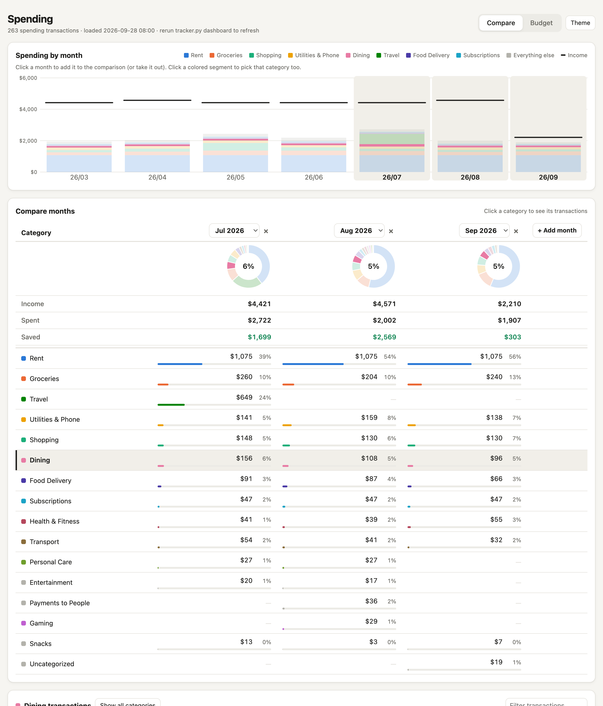
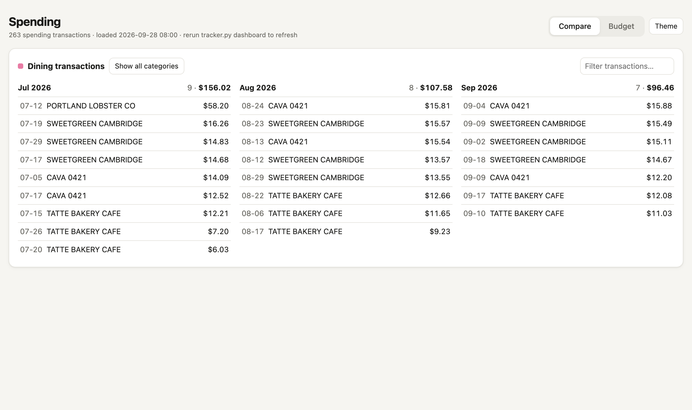
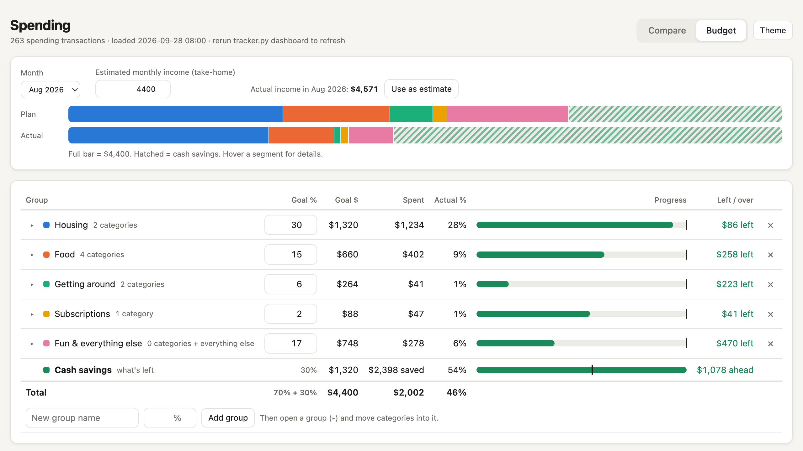
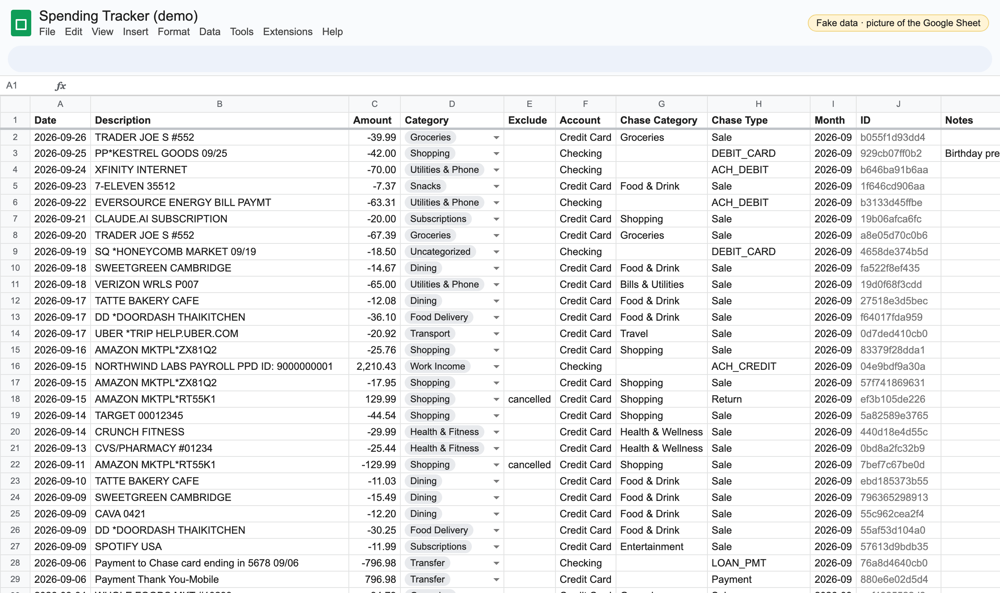
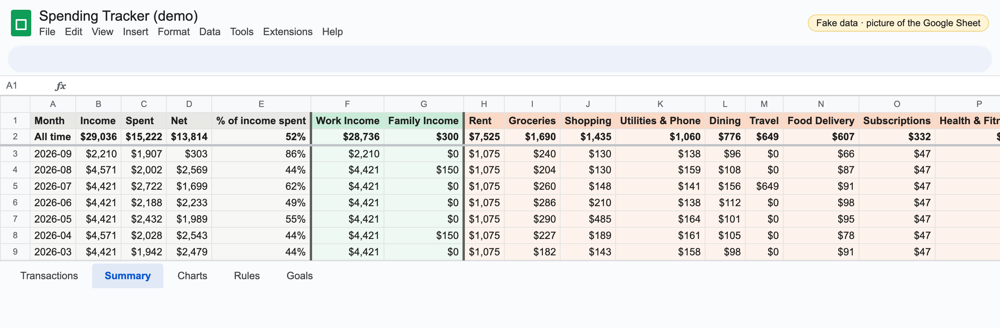
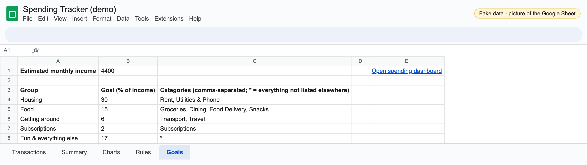

# spending-tracker

**Overview** · [Setup](docs/SETUP.md) · [Features & commands](docs/FEATURES.md) · [Phone dashboard](docs/PHONE-DASHBOARD.md) · [History](docs/HISTORY.md) · [Live demo](docs/DEMO.md)

Turn Chase checking and credit card activity into a categorized spending tracker in your own Google Sheet, with an interactive dashboard on your computer and your phone.

Transactions come in from Chase CSV downloads or automatically from [Plaid](https://plaid.com) twice a day. Merchant rules sort them into categories, and the Sheet keeps the ledger and a month-by-month Summary. The dashboard, a single HTML page, is where you compare months and track budget goals. The same page runs as a private Google Apps Script web app, so it opens on your phone with live data from the Sheet and only works for Google accounts the Sheet is shared with.

**Live demo:** the **[demo spreadsheet](https://docs.google.com/spreadsheets/d/1ewAz3ph69PqMhJkR85uOpalluf4-KS3Aw70xpjA5lgA/edit)** is public and view only, with the real tabs written by the real code. The demo dashboard link is on the [Live demo](docs/DEMO.md) page.

> Every screenshot below uses **fake data** for a made-up person, generated by [`tools/make_demo.py`](tools/make_demo.py) and run through the real parser, rules, cancellation pairing and split code. The data files are in [`examples/demo/`](examples/demo/).

## The dashboard

**Compare**: pick any months. You get one row per category and one column per month, with a donut of each month's mix and monthly stacked bars against income.



Click a category (in the table, a donut or a bar) and its transactions for each chosen month appear side by side:



**Budget**: set your take-home income, group categories into buckets (Housing, Food, ...) and give each a % of income. Whatever the groups leave over is your cash-savings target. Each group shows its spending against its goal, next to a bar comparing plan and actual.



**On your phone**: the same page, served by Apps Script from the Sheet. It reads the Sheet live, so Plaid syncs show up without your computer. [How the private link works](docs/PHONE-DASHBOARD.md).

<p align="center"></p>

## The Google Sheet

**Transactions**: every row from every account, newest first. Category is a dropdown. Exclude and Notes are yours to edit, and the bank's columns warn before an edit. A charge and its refund are marked `cancelled` in Exclude automatically.



**Summary**: income, spending, net and % of income spent per month, then one column per income source and spending category, ordered by your own totals. All cells are live formulas over Transactions.



**Goals**: the budget from the dashboard, readable and editable in the Sheet. E1 holds the link that opens the phone dashboard.



There's also a **Rules** tab (your own "merchant text → category" rules), a hidden **Sync** tab (Plaid's bookmark), and a **Charts** tab. The Charts tab is from before the dashboard existed and is still built, but the dashboard replaced it for analysis. [History](docs/HISTORY.md) explains why.

## What it handles

| Problem | What the tool does |
|---|---|
| Paying the card shows up in checking *and* on the card, which counts spending twice | Card payments and moves between your own accounts are **Transfer** and never count as spending or income |
| Re-downloading overlapping date ranges, or mixing CSVs with Plaid | Every row gets a stable ID from account, posted date, amount and description, so nothing is added twice |
| Cancelled orders | A charge followed within 10 days by an equal refund from the same merchant gets `cancelled` on both rows |
| Chase's categories are coarse (and checking has none) | Your rules first, then Chase's transaction type, then Chase's or Plaid's category. Anything left is `Uncategorized` |
| One payment covering several things (a roommate's Zelle for rent + utilities) | `split` divides one row across categories |
| Money a friend pays you back | It goes in the expense's category, so it reduces that spending instead of counting as income |

## Try it in two minutes

No Google account needed:

```bash
git clone https://github.com/jadenzou1-dotcom/spending-tracker.git
cd spending-tracker
python3 -m venv .venv && .venv/bin/pip install -r requirements.txt
.venv/bin/python tracker.py --local import examples/demo/Chase*.csv
.venv/bin/python tracker.py --local dashboard
```

`--local` keeps everything in `data/transactions.csv` (gitignored) instead of a Sheet. To see the Budget view filled in, add the demo goals with `cp examples/demo/goals.csv data/goals.csv` before starting the dashboard. Or, after cloning, open `docs/demo/dashboard.html` in a browser: it's the finished demo page, a single file.

For the real thing, including the Sheet, Plaid, the scheduled job and the phone dashboard, see **[Setup](docs/SETUP.md)**.

## How it fits together

```
Chase CSVs ──┐                                   ┌─► Transactions / Summary / Goals tabs
             ├─► tracker.py (parse → dedupe →    │
Plaid sync ──┘    categorize → pair refunds) ────┤
  (GitHub Actions,                               ├─► tracker.py dashboard   (your computer, 127.0.0.1)
   private repo, 2×/day)                         └─► Apps Script web app    (your phone, reads the Sheet live)
```

- **Python** (`tracker.py`, `spending_tracker/`): parsing, rules, dedupe, Sheets writes, Plaid, the local dashboard server. The only dependencies are gspread and requests.
- **Google Sheets**: the ledger and the source of truth. You can edit categories, excludes and notes there, and your edits survive every import.
- **One HTML page** (`spending_tracker/dashboard.html`): no framework and no build step. Served locally by Python, or by Apps Script with the Sheet's data filled in.
- **GitHub Actions** in a separate private repo runs `tracker.py sync` on a schedule, so bank data never appears in public logs.

## Privacy

Your data stays on your machine and in your own Google account. The repo ignores `config.json`, service-account keys, `rules.local.csv`, `data/` and every CSV except the default rules and the fake examples. Plaid keys live in the Mac Keychain locally and in a private repo's encrypted Actions secrets for scheduled runs. The local dashboard only listens on 127.0.0.1, and the phone dashboard only returns data to Google accounts the Sheet is shared with. Personal rules (landlord, employer, friends' names) go in the Sheet's Rules tab, never in committed files.

## Using it with Claude Code

The repo's [`CLAUDE.md`](CLAUDE.md) teaches [Claude Code](https://claude.com/claude-code) the workflow. Say "import my statements" or "go through my uncategorized transactions" and it proposes rules, asks about merchants it can't identify, records what you tell it in Notes, and applies splits you describe in plain English.

## License

MIT
