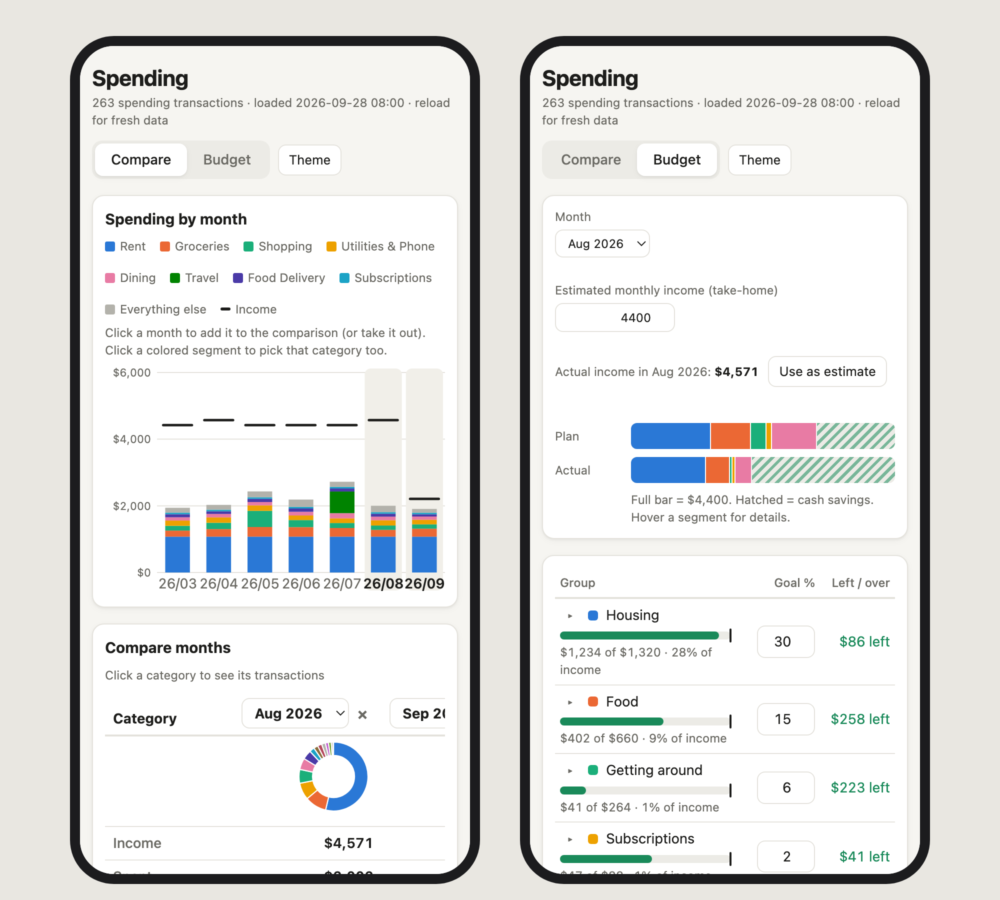
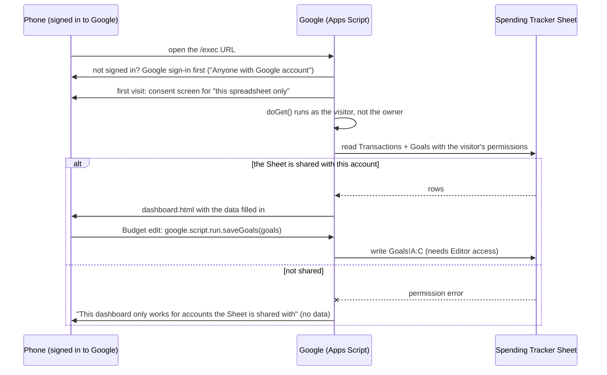

# Phone dashboard: a link that only works for your own accounts

[Overview](../README.md) · [Setup](SETUP.md) · [Features & commands](FEATURES.md) · **Phone dashboard** · [History](HISTORY.md)

The dashboard started as a page served from `127.0.0.1`, which is useless on a phone. The goal was to open it on a phone with live data, **without hosting anything, without a domain, and without exposing bank transactions to anyone who gets hold of the URL**. There was one extra constraint: the phone is signed in to a *different* personal Google account than the one that owns the Sheet.

The answer was a Google Apps Script web app bound to the Sheet, which **runs as whoever opens it**. The URL is effectively public, but the data behind it isn't: it only loads for Google accounts the Sheet itself is shared with. In practice that means exactly two accounts, the owner and the phone's.

<p align="center"></p>

Setup steps are in [Setup §7](SETUP.md#7-dashboard-on-your-phone-optional). This page covers why it's built this way.

## How a visit works



## The pieces

**[`apps_script/appsscript.json`](../apps_script/appsscript.json)**, the manifest:

```json
"oauthScopes": ["https://www.googleapis.com/auth/spreadsheets.currentonly"],
"webapp": { "executeAs": "USER_ACCESSING", "access": "ANYONE" }
```

- `executeAs: USER_ACCESSING` means every call runs with the **visitor's** Google identity. The script has no standing access of its own.
- `access: ANYONE` is shown as "Anyone with Google account" in the deploy dialog. Google only requires the visitor to be signed in to *some* Google account, so this setting is deliberately loose, because it isn't the gate.
- `spreadsheets.currentonly` means that when someone authorizes the script, they grant access to **only the spreadsheet the script is bound to**, not their Drive or their other Sheets. Without this line Apps Script would infer the much broader `spreadsheets` scope.

**[`apps_script/Code.gs`](../apps_script/Code.gs)**:

- `doGet()` calls `loadData_()`, which opens `SpreadsheetApp.getActiveSpreadsheet()`. For a visitor the Sheet isn't shared with, that read throws. `doGet` catches it and returns a one-line message. The template is only filled **after** a successful read, so a visitor without access never receives any data, not even in the page source.
- `loadData_()` keeps the same rows `dashboard.py` does (Exclude blank, no Transfers) and reads Goals with the same layout as `parse_goals`.
- The page is the same `spending_tracker/dashboard.html` used locally. `tools/apps_script.py index` swaps its `/*DATA*/null` placeholder for `<?!= data ?>`, and `doGet` fills that with JSON (`</` escaped, so a description can't close the `<script>` tag).
- `saveGoals()` is called from the page through `google.script.run`, and also runs as the visitor, so saving needs **Editor** access to the Sheet. It mirrors `clean_goals()` in Python: caps on lengths and counts, a category in at most one group, a leading `= + - @` stripped so nothing becomes a formula, and it writes as plain text into columns A–C only.

**The Sheet's sharing list is the access list.** Owner plus one other personal account, as Editor, means exactly those two accounts see data. Adding a device on a third account means sharing the Sheet with it. Removing access means un-sharing, and it takes effect on the next page load. There's no separate password, allowlist or token to leak or rotate.

## Why not the other options

| Execute as | Who has access | Who sees data | Problem |
|---|---|---|---|
| Me (owner) | Only myself | owner account only | **First version.** The phone's account was locked out, and switching accounts on the phone just to check spending wasn't practical |
| Me (owner) | Anyone with Google account | **anyone with the URL** | The script reads the Sheet as the owner for every visitor, so the URL becomes a password that can be forwarded, logged or leaked |
| Me (owner) | Anyone | anyone, even signed out | Same, and worse |
| Me (owner) + an email allowlist in code | Anyone with Google account | listed emails | When the script runs as the owner, `Session.getActiveUser()` usually comes back blank for other personal accounts, so there's no reliable email to check |
| **The visitor** | **Anyone with Google account** | **accounts the Sheet is shared with** | Each account approves the script once. This is the one used |

Hosting the page anywhere else (a small server, or Cloudflare Workers, which had already been ruled out for the sync job) would need its own login system and its own copy of the data. Apps Script is free, lives next to the data, and uses Google's login.

## Gotchas found along the way

- **Several Google accounts in one browser.** With more than one account signed in, Apps Script (both the editor and `/exec` URLs) tends to act as the browser's *default* account (`/u/0`) and fails with unhelpful "unable to open file" errors. Deploying and updating worked reliably from a Chrome profile where the owner is the default account. On a phone with a single account this doesn't come up.
- **"Google hasn't verified this app."** Expected for your own unpublished script. Choose Advanced → Go to ... (unsafe) → Allow. The consent screen should list only "View and manage spreadsheets that this application has been installed in". If it asks for more, check the manifest.
- **Updating keeps the URL** only if you edit the existing deployment (Manage deployments → ✏️ → New version). "New deployment" creates a second URL. A stray extra deployment is harmless but confusing, so delete it.
- **Anyone with the link sees the consent screen** and the project's name, but no data. Give the project a boring name.
- **Budget saves need Editor.** A Viewer-shared account can view the dashboard, but its saves fail with "Couldn't save".
